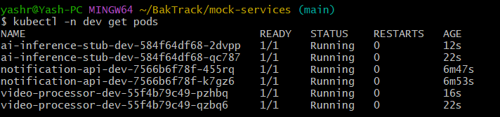

# BakTrack Helm Charts

Helm charts for the three mock BakTrack microservices. Part of the [BakTrack EKS Reference Architecture](https://github.com/Yash-Rathod/infra-terraform).


---

## Charts

| Chart | Image | Endpoint | Port |
|---|---|---|---|
| `notification-api` | ECR `notification-api` | `POST /notify` | 8080 |
| `video-processor` | ECR `video-processor` | `POST /process` | 8080 |
| `ai-inference-stub` | ECR `ai-inference-stub` | `POST /summarize` | 8080 |

All charts share the same structure:
- `Deployment` — 2 replicas, resource requests/limits set, liveness + readiness on `/health`
- `Service` — ClusterIP, port 80 → targetPort 8080
- `ServiceAccount` — created per chart, annotated for IRSA if needed
- `ServiceMonitor` — Prometheus scraping on `/metrics` every 30s (requires `kube-prometheus-stack`)

When deployed via ArgoCD, the full resource tree for each chart looks like this:


All three service pods running in the `dev` namespace after a successful GitOps rollout:



---

## Values

Key values (same shape for all three charts):

```yaml
replicaCount: 2

image:
  repository: <account>.dkr.ecr.ap-south-1.amazonaws.com/<service>
  pullPolicy: IfNotPresent
  tag: ""          # set by CI with the git SHA (7 chars)

service:
  type: ClusterIP
  port: 80
  targetPort: 8080

resources:
  requests: { cpu: 50m, memory: 64Mi }
  limits:   { cpu: 200m, memory: 128Mi }

livenessProbe:
  httpGet: { path: /health, port: 8080 }
readinessProbe:
  httpGet: { path: /health, port: 8080 }

podAnnotations:
  prometheus.io/scrape: "true"
  prometheus.io/port:   "8080"

serviceMonitor:
  enabled: true
```

---

## Usage

### Lint

```bash
helm lint charts/notification-api
helm lint charts/video-processor
helm lint charts/ai-inference-stub
```

### Render (dry run)

```bash
helm template charts/notification-api \
  --set image.tag=abc1234 \
  --set image.repository=347486023960.dkr.ecr.ap-south-1.amazonaws.com/notification-api
```

### Manual install (not needed — ArgoCD manages this)

```bash
helm install notification-api-dev charts/notification-api \
  --namespace dev --create-namespace \
  --set image.tag=<sha>
```

---

## CI/CD Integration

These charts are consumed by [`apps-config`](https://github.com/Yash-Rathod/apps-config) via ArgoCD. The CI pipeline in [`mock-services`](https://github.com/Yash-Rathod/mock-services) bumps the `image.tag` value in `apps-config` after each successful image push. ArgoCD detects the change and rolls out a new version automatically.

```
mock-services push
  └─▶ GitHub Actions
        ├─ pytest
        ├─ docker build + push → ECR
        └─ bump tag in apps-config
              └─▶ ArgoCD detects diff
                    └─▶ helm upgrade (this repo)
```

---

## License

MIT © 2026 Yash Rathod
